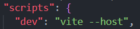
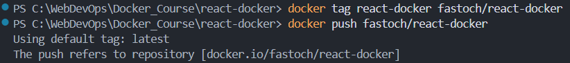

# Resources

- https://www.youtube.com/watch?v=GFgJkfScVNU&t=128s

# Introduction

The following concepts apply to any containerizing software, Docker was just the pioneer (2013).  
Podman is actually better than Docker, in addition to being Free and Open Source Software (FOSS), but it came out in 2019.

# What is Docker and why do we need it?

## Docker is a software industry standard

Docker is used by 57% of professional developers (2024). It became a **critical skill**.  
Using Docker is equally profitable for **developing** our application, **testing** it, and **deploying** it to production.  

## Consistency

Docker allows us to **containerize** our applications, so they **run the same on any host** environment.  

## Portability & Speed

A Docker container is a self-contained "box" that includes all the things needed for our application to run smoothly: 
- its own OS
- our code
- the dependencies
- the runtimes
- the config files

Docker containers are also **lightweight**, and they share the host system resources, making them more efficient than any traditional VM.  
This efficiency translates to **faster** application start times, and **reduced resource usage**.  

## Version Control

Docker also helps with **Version control**, as just like we track versions of our code using Git, Docker helps us versions of our application.  
It's like having a rewind button for our app, so we can return to a previous version if something goes wrong.  

## Scalability

Docker makes it easy to handle more users by creating copies of our application when needed.  

## DevOps integration

Docker bridges the gap between Development and Operations, streamlining the workflow from coding to deployment.  
This integration ensures that the software is developed, tested, and deployed efficiently, with continuous feedback and collaboration.

# How does Docker work?

There are 2 very important concepts: **images** and **containers**, the entire workflow revolves around them.  

## Images

A Docker image is a lightweight standalone executable package that includes everything neede to run a piece of software.  
It includes the code, runtimes (like Node.js), libraries, system tools, and even the operating system.  

Think of a Docker image as a recipe for running our application.  
It not only lists the ingredients (codes and libraries), but also provides the instructions (runtime and system tools).  

## Containers

A Docker container is a runnable instance of a Docker image.  
It represents the **execution environment** for a specific application.  

A container takes everything specified in the image and follows its instructions by:
- executing necessary commands,
- downloading packages,
- and setting things up to run our application.

If a container image is the recipe, the running container is the cake.  
We can run multiple containers from a single image.  

## Volumes

Docker volumes are persistent data storage mechanisms for containers.  
They provide a way to store and share data between containers, ensuring that important information persists when containers are stopped or removed.  

### Types of Docker Volumes

- **Named Volumes**: stored in a directory on the host machine
- **Anonymous Volumes**: similar to named volumes but with automatically generated names
- **Bind Mounts**: map a directory or file on the host system to a directory or file within the container

## Network

Docker Network is a communication system that enables different containers to talk to each other, or with the external world.  

# Docker Workflow

The Docker workflow is distributed into 3 parts: 
- Docker client
- Docker host (Docker daemon)
- Docker registry (DockerHub)

## Docker client

It's the tool we use for interacting with the Docker daemon, it can be the **CLI** or the **GUI**.  
It can be considered as the command center from where we issue instructions to the Docker daemon.  

## Docker daemon

It's the background process responsible for managing containers on the host system.  
It listens for Docker client commands, and does what the client asks for.  

## Docker registry

DockerHub is a centralized repository hosting thousands of Docker images.  
It hosts both public and private packages.  

Docker is to DockerHub what Git is to GitHub.  

When you run a container, Docker pulls the required image from the registry, unless the image is already available locally.  

# How do we create our own Docker images?

Creating a Docker image is done through a special file called **Dockerfile**.  
It's a set of instructions telling Docker how to build the image for our application.  

We use specific **keywords** to tell Docker what we want through the Dockerfile.  
Here's a list of the most used keywords in a Dockerfile:
```dockerfile
# Use that as the base image
FROM ubuntu:24.04

# Set the working directory for the subsequent instructions
WORKDIR /app

# Copy the files from the host machine to the image's filesystem
COPY . /app

# Execute this command in the shell during image build
RUN npm run dev

# Make the container listen on the specified network port
EXPOSE 3000

# Set the following environment variable
ENV NODE_ENV=production

# Define build-time variables
ARG NODE_VERSION=20

# Create a mount point at the specified path 
VOLUME /myvol

# Specify the default command to execute when the container starts
CMD ["executable","param1","param2"]
```

`VOLUME` specifies a location inside the container where you can connect external storage.  

# Running our first Docker commands

Let's pull one of the OS images available in the Docker Hub:  
```bash
docker pull ubuntu
```

Now, let's create a container from this image:
```bash
docker run -it ubuntu
```

# Our first custom image (hello-docker)

- open VS Code
- create a new folder 'Docker_course' wherever you want on your local machine
- open this folder in VS Code
- now, create another folder called 'hello-docker'
- inside this folder, create an 'hello.js' file with a simple `console.log('Hello Docker!');`
- create a Dockerfile and add the following instructions into it:
  
```dockerfile
FROM node:20-alpine

WORKDIR /app

COPY . .

CMD ["node", "hello.js"]
```

- open a terminal in VS Code and run `cd hello-docker`
- now build your first image by running `docker build -t hello-docker .`
  - The `-t` will tag our image with the name 'hello-docker'
  - the final dot is for specifying the path to our Dockerfile, which is the current directory

We can check that our image was created by running `docker images`.  

Now, we can run a container from our image: `docker run hello-docker`  


The container immediately stops running after the main process (defined in our Dockerfile via CMD) completes its execution.  
To keep it running, we can use `docker run -it hello-docker sh`, which puts us directly within the container OS.  
Then, we can run `cat /etc/os-release` to check which OS our container is running on.  


We could also run `node hello.js` to log 'Hello Docker!' to the console.  

# Publishing a custom image to the Docker Hub

## React Docker Demo (react-docker)

### Initialize a React project

To containerize our first React application, we first need to initialize a React project in VS Code.  
- in your VS Code terminal, run `cd ..` to go back to your 'docker_course' folder
- install Node.js on your local machine, and check installation via `node -v`
- if installing Node.js hasn't also installed npm (Node package manager), then install npm and run `npm -v`
- go back to your terminal and run `npm create vite@latest react-docker` to initialize your React project with Vite
  - Vite is a modern JavaScript build tool and development server
  - the `npm create vite` command might require the installation of the `create-vite` package, say yes 
- the previous command will open a wizard that prompts you to choose a JavaScript framework and a variant:
  - choose React
  - choose TypeScript
- then run `cd react-docker` to enter your React project folder
- and we won't run `npm install` because the dependencies will be installed within our container

### Create a Dockerfile

Inside our newly created 'react-docker' folder, let's create a Dockerfile.  
- add the following instructions to the Dockerfile:
```dockerfile
# set the base image to create the image for our react app
FROM node:20-alpine

# create a dedicated 'app' group and an 'app' user with permissions to run the app
# This is done to avoid running the app as root
# If the app is run as root, any vulnerability in the app can be exploited to gain access to the host system
RUN addgroup -S app && adduser -S -g app app

# set the working directory to /app
WORKDIR /app

# copy package.json and package-lock.json to the working directory 
COPY package*.json ./

# change the ownership of the application files to the app user
RUN chown -R app:app /app

# set the user to run the app
USER app

# install dependencies
RUN npm install

# copy the rest of the application files to the working directory 
COPY . .

# expose port 5173 to tell Docker that the container listens on that port at runtime
EXPOSE 5173

# command to run the app
CMD ["npm", "run", "dev"]
```

### Create a .dockerignore

In our react-docker folder, create a file called .dockerignore and add the following line:  
`node_modules`

Adding node_modules to .dockerignore optimizes your Docker workflow by:
- reducing build times, 
- ensuring proper dependency management, 
- and creating smaller and more secure images

More details: https://www.perplexity.ai/search/what-s-the-point-of-creating-a-afotMP9zRoq0DJOeP1NgHw

### Build the image

- open a terminal in VS Code
- navigate via `cd` to your 'react-docker' folder
- run `docker build -t react-docker .`

The dot at the end of the command specifies the path to the Dockerfile, which is the current directory.  

### Run the container

To run the container, we need to specify 2 things:
- the port mapping between the host and the container 
- the image name

The command to run is: `docker run -p 5173:5173 react-docker`  

But this won't work as is, because we need to expose our dev environment to the host.  
To do that, we need to modify the *dev* script in our package.json file as follows:    



To apply the change to our container, we need to rebuild the image.  
- First, let's stop the container: `docker stop <container_id>`
- Then, remove it: `docker rm <container_id>`
- Remove the image: `docker rmi <image_id>`
- Navigate to the 'react-docker' folder: `cd react-docker`
- Re-build the image: `docker build -t react-docker .`
- Run the container: `docker run -p 5173:5173 react-docker`

Now we can open a web browser (on the host) and navigate to http://localhost:5173/ to see our React app running.  

### Mount the local folder into the container

But now, if we go back to our code, go to the 'src/App.tsx' file and change the text in the h1 tag, we won't see the change 
reflected in the browser, which is not ideal in a development environment...  

That's because we have changed the code on our local machine, but the code in the container is still the same.  

To fix this, we need to mount the current working directory into the /app directory inside the container:
- stop the active container: `docker stop <container_id>`
- make sure you're in the 'react-docker' folder
- run `docker run -p 5173:5173 -v "$(pwd):/app" -v /app/node_modules react-docker`

The `-v` flag stands for volume, and the `$(pwd)` command returns the current working directory.  

The second volume is to create a node_modules folder inside the container, which is required for the app to run.  
Because the dependencies that will be installed via `npm install` will be stored in this node_modules folder.  

Now, our local code is linked to the container, and any changes we make locally will be immediately reflected inside the running container.   
We can check that by going back to the 'src/App.tsx' file and changing the text in the h1 tag.  

---

If you're using Vite with WSL2, the changes won't be reflected. That's a common issue.  
More details: https://dev.to/proparitoshsingh/hmr-not-working-in-vite-on-wsl2-5h2k  

To fix this WSL2 issue, add the following server.watch config to the vite.config file:
```javascript
export default defineConfig({
  server: {
    watch: {
      usePolling: true, // Enable polling for file changes
    },
  },
});
```

By enabling polling in Vite, you can ensure that HMR (Hot Module Replacement) works reliably with WSL2.  

---

**Side Note about Type Errors in the App.tsx file**:  
The App.tsx file might report a lot of errors, that's because we're using TypeScript.  
Just run `npm i @types/react @types/react-dom` to fix the errors. This will install the necessary type definitions for React and ReactDOM.  

Now we have successfully learnt how to containerize a React application using Docker.  

## Publish the image

First, we need to create a Docker Hub account, so we can authenticate from the CLI.  
If we're already logged in with Docker Desktop, the authentication will be automatic.

From the command-line:  
```bash
# Navigate to the react-docker folder
cd react-docker
docker login
# Publish the image
docker tag <source_image> <docker_hub_username>/<target_image>
docker push <docker_hub_username>/<target_image>
```



Now we can visit Docker Hub, sign in, and see our newly published image.  
And other users can pull the image from Docker Hub and run it on their machines.  

# Docker Compose

Now that we know the basis, let's see how we can use Docker Compose to simplify our workflow.  
Docker Compose allows us to define and manage multiple containers as a single application.  

It uses a YAML file (docker-compose.yaml) to configure the services, networks, and volumes for our application.  
Which enables us to run and scale the entire application with a single command: `docker compose up`.  

We don't have to run 10 commands to run 10 containers for one application.  
We can list all the information needed to run our multi-container application in a docker-compose.yaml file, 
and then run only one command that triggers running all the containers that make up our app.  

And while we can manually create a docker-compose.yaml file on our own, Docker provides us with a command-line tool 
that generates this file for us. It's called **docker init**.  

## About docker init

**docker init** is a command-line utility introduced by Docker to streamline the process of containerizing applications.  
This tool automatically generates essential Docker-related files for a project, including: 
- *Dockerfile*
- *compose.yaml*
- *.dockerignore*
- *README.Docker.md* 

Using **docker init**, we initialize our application with all the files needed to containerize it.  
**docker init** allows us to specify our tech choices.  

## Our second Vite project

- open up a terminal in VS Code
- navigate to our tutorial root folder, which is Docker_Course
- run `npm create vite@latest vite-project`
- select `React` and then `TypeScript`
- `cd vite-project`
- run `npm install` to install Node.js dependencies
  - It reads the `package.json` file and installs the specified packages into the `node_modules` folder
- now we can use `docker init` to generates the Docker-related files for our project

### Using docker init

On running `docker init`, we get asked a few questions based off which it's going to generate the `compose.yaml` file:  
- select `Node` as the application platform
- select `npm` as your ppackage manager
- we don't want run `npm run build` before starting the server
- the command we want to use to start the app is `npm run dev`
- our server will listen on port 5173

And that's it! The above `docker init` command has generated 4 Docker files for us:
- *Dockerfile*: the file that tells Docker how to build our image
- *.dockerignore*: a file that tells Docker which files to ignore when building the image
- *compose.yaml*: the file that defines the services, networks, and volumes for our application
- *README.Docker.md*: a file that explains how to use the above Docker files

### Modifying the new Docker files

- first, let's replace the new Dockerfile with the one we created for our react-docker app
- then, let's modify the compose.yaml file by renaming the server into "web"
  - Renaming the server into "web" is a convention for running web apps, but it's not required.  
- still in the compose.yaml file, we can also remove the environment variables, as we won't use them. 
- finally, we need to add the volumes for our web service 

Our compose.yaml file should now look like this:
```yaml
services:
  web:
    build:
      context: .
    ports:
      - 5173:5173
    volumes:
      - .:/app
      - /app/node_modules
```

The volumes section in our compose.yaml file is used to mount volumes between the host machine and the container.  
It's similar to what we have done manually when using the `docker run` command (line 311).  

### A word about leveraging Docker cache

https://www.kdnuggets.com/how-to-leverage-docker-cache-for-optimizing-build-speeds

# Docker Compose Up (April 2022)

- Run `docker commpose up` to start the application

This won't work as is, because we need to expose our dev environment to the host.  
To do that, we need to modify the *dev* script in our package.json file as follows:
```json
"scripts": {
  "dev": "vite --host",
```

And if you get a "permission denied" error:
- restart VS Code as administrator if you're on Windows
- run `sudo docker compose up` if you're on Mac or Linux

So, now it works, we can run our application with `docker compose up`.  
We can open up a web browser (on the host) and navigate to http://localhost:5173/ to see our React app running.  

## Optimizing the DX

But still, it isn't optimal for developer experience (DX).  
Every time we make a change to our code, we need to stop the container and run `docker compose up` again.  

Sure, Docker Compose solves the problem of showing up-to-date code changes through *volumes*,  
lets us manage multiple containers in a single file, and merges the image building and running functions.  

All of that is great, but it doesn't do these things automatically when we change something related to the package files,  
or when we think it's needed to rebuild the image.  

This is where our next Docker feature comes in: `docker compose watch`.  

# Docker Compose Watch (September 2023)

This command listens for changes, and does what needs to be done, like:
- rebuilding our app
- re-running the container
- and more

With `docker compose watch`, we can do 3 main things: 
- **Sync**: the Sync operation moves changed files from the host to the right places in the container
  - happens while the app is running, beneficial for development
- **Rebuild**: the Rebuild process starts with the creation of new images, and then updates the services 
  - beneficial when rolling out changes to applications in production
- **Sync-restart**: this operation merges the Sync and Rebuild processes
  - it begins by syncing modifications from the host filesystem to the container's, and then restarts the container
  - beneficial for development and testing 


To see `docker compose watch` in action, we'll build a basic MERN project.  
MERN stack = MongoDB + Express + React + Node.js
- React for the frontend part
- Node.js + Express for the backend
- MongoDB for the database


# Containerizing a MERN app

Download the starter_mern-docker folder from here and open it in VS Code:  
https://github.com/adrianhajdin/docker-course/tree/main  

- create a new Dockerfile in the 'frontend' folder 
- copy the Dockerfile contents from the 'react-docker' folder
- remove the comments from this Dockerfile
- create a .dockerignore file in the 'frontend' folder
- add "node_modules" to the .dockerignore file so Docker ignores this folder
- copy the previous Dockerfile in the 'backend' folder and modify it as follows: 
```dockerfile
FROM node:20-alpine
RUN addgroup -S app && adduser -S -g app app
WORKDIR /app
COPY package*.json ./
RUN chown -R app:app /app
USER app
RUN npm install
COPY . .
EXPOSE 8000
CMD ["npm", "start"]
```

The `npm start` command is used to start the Node.js application.  
It corresponds to the `start` script in the package.json file:
```json
"scripts": {
  "start": "nodemon index.js",
  ...
}
```

- we can also add a .dockerignore file in the 'backend' folder
- add "node_modules" to the .dockerignore file so Docker ignores this folder

Now we have everything set up, except for one thing: the *compose.yaml* file.  
This file is what ties the backend and frontend services together.  

## The compose.yaml file

This file allows us to specify everything we want to do with our Docker Compose application.  

- create a new file called *compose.yaml* in the root folder ('mern-docker' in our case)
- copy the contents from: https://github.com/adrianhajdin/docker-course/blob/main/mern-docker/compose.yml

Our compose.yaml file defines the 3 services that make up our application:
- **web**: our React frontend 
- **api**: our Node/Express backend 
- **db**: our MongoDB database

### Explaining the compose.yaml file

- First, we need to specify the version of Docker Compose we're using:
```yaml
version: "3.8"
```

>[!important]
>Actually, Compose V2 (2022-2025) has made the 'version' top-level element obsolete and no longer required.  

- Next, and most important step, we need to define our services/containers to be run:
```yaml
services:
  web:
  api:
  db:
```

For the first service, we could use any name, "web" is just a standard naming convention for the frontend.  

- Finally, we define the volumes to be used by our services:
```yaml
volumes:
  anime:
```
Here, we create a new volume named "anime" as this app is going to be about showing anime shows.  

Looking at this from high-level overview:
```yaml
services:
  web:
  api:
  db:

volumes:
  anime:
```

Now, we need to define each individual service:  
```yaml
services:
  web:
    depends_on:
      - api
```
- the web service depends on the api service, so the api service will be started before the web service
- 


@61/88
