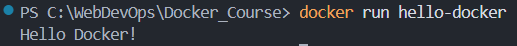
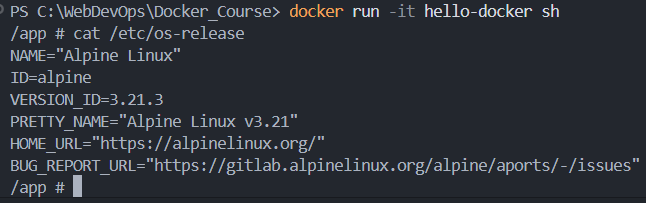

# Resources

- https://www.youtube.com/watch?v=GFgJkfScVNU&t=128s

# Introduction

The following concepts apply to any containerizing software, Docker was just the pioneer (2013).  
Podman is actually better than Docker, in addition to being Free and Open Source Software (FOSS), but it came out in 2019.

# What is Docker and why do we need it?

## Docker is a software industry standard

Docker is used by 57% of professional developers (2024). It became a **critical skill**.  
Using Docker is equally profitable for **developing** our application, **testing** it, and **deploying** it to production.  

## Consistency

Docker allows us to **containerize** our applications, so they **run the same on any host** environment.  

## Portability & Speed

A Docker container is a self-contained "box" that includes all the things needed for our application to run smoothly: 
- its own OS
- our code
- the dependencies
- the runtimes
- the config files

Docker containers are also **lightweight**, and they share the host system resources, making them more efficient than any traditional VM.  
This efficiency translates to **faster** application start times, and **reduced resource usage**.  

## Version Control

Docker also helps with **Version control**, as just like we track versions of our code using Git, Docker helps us versions of our application.  
It's like having a rewind button for our app, so we can return to a previous version if something goes wrong.  

## Scalability

Docker makes it easy to handle more users by creating copies of our application when needed.  

## DevOps integration

Docker bridges the gap between Development and Operations, streamlining the workflow from coding to deployment.  
This integration ensures that the software is developed, tested, and deployed efficiently, with continuous feedback and collaboration.

# How does Docker work?

There are 2 very important concepts: **images** and **containers**, the entire workflow revolves around them.  

## Images

A Docker image is a lightweight standalone executable package that includes everything neede to run a piece of software.  
It includes the code, runtimes (like Node.js), libraries, system tools, and even the operating system.  

Think of a Docker image as a recipe for running our application.  
It not only lists the ingredients (codes and libraries), but also provides the instructions (runtime and system tools).  

## Containers

A Docker container is a runnable instance of a Docker image.  
It represents the **execution environment** for a specific application.  

A container takes everything specified in the image and follows its instructions by:
- executing necessary commands,
- downloading packages,
- and setting things up to run our application.

If a container image is the recipe, the running container is the cake.  
We can run multiple containers from a single image.  

## Volumes

Docker volumes are persistent data storage mechanisms for containers.  
They provide a way to store and share data between containers, ensuring that important information persists when containers are stopped or removed.  

### Types of Docker Volumes

- **Named Volumes**: stored in a directory on the host machine
- **Anonymous Volumes**: similar to named volumes but with automatically generated names
- **Bind Mounts**: map a directory or file on the host system to a directory or file within the container

## Network

Docker Network is a communication system that enables different containers to talk to each other, or with the external world.  

# Docker Workflow

The Docker workflow is distributed into 3 parts: 
- Docker client
- Docker host (Docker daemon)
- Docker registry (DockerHub)

## Docker client

It's the tool we use for interacting with the Docker daemon, it can be the **CLI** or the **GUI**.  
It can be considered as the command center from where we issue instructions to the Docker daemon.  

## Docker daemon

It's the background process responsible for managing containers on the host system.  
It listens for Docker client commands, and does what the client asks for.  

## Docker registry

DockerHub is a centralized repository hosting thousands of Docker images.  
It hosts both public and private packages.  

Docker is to DockerHub what Git is to GitHub.  

When you run a container, Docker pulls the required image from the registry, unless the image is already available locally.  

# How do we create our own Docker images?

Creating a Docker image is done through a special file called **Dockerfile**.  
It's a set of instructions telling Docker how to build the image for our application.  

We use specific **keywords** to tell Docker what we want through the Dockerfile.  
Here's a list of the most used keywords in a Dockerfile:
```dockerfile
# Use that as the base image
FROM ubuntu:24.04

# Set the working directory for the subsequent instructions
WORKDIR /app

# Copy the files from the host machine to the image's filesystem
COPY . /app

# Execute this command in the shell during image build
RUN npm run dev

# Make the container listen on the specified network port
EXPOSE 3000

# Set the following environment variable
ENV NODE_ENV=production

# Define build-time variables
ARG NODE_VERSION=20

# Create a mount point at the specified path 
VOLUME /myvol

# Specify the default command to execute when the container starts
CMD ["executable","param1","param2"]
```

`VOLUME` specifies a location inside the container where you can connect external storage.  

# Running our first Docker commands

Let's pull one of the OS images available in the Docker Hub:  
```bash
docker pull ubuntu
```

Now, let's create a container from this image:
```bash
docker run -it ubuntu
```

# Our first custom image (hello-docker)

- open VS Code
- create a new folder 'Docker_course' wherever you want on your local machine
- open this folder in VS Code
- now, create another folder called 'hello-docker'
- inside this folder, create an 'hello.js' file with a simple `console.log('Hello Docker!');`
- create a Dockerfile and add the following instructions into it:
  
```dockerfile
FROM node:20-alpine

WORKDIR /app

COPY . .

CMD ["node", "hello.js"]
```

- open a terminal in VS Code and run `cd hello-docker`
- now build your first image by running `docker build -t hello-docker .`
  - The `-t` will tag our image with the name 'hello-docker'
  - the final dot is for specifying the path to our Dockerfile, which is the current directory

We can check that our image was created by running `docker images`.  

Now, we can run a container from our image: `docker run hello-docker`  



The container immediately stops running after the main process (defined in our Dockerfile via CMD) completes its execution.  
To keep it running, we can use `docker run -it hello-docker sh`, which puts us directly within the container OS.  
Then, we can run `cat /etc/os-release` to check which OS our container is running on.  



We could also run `node hello.js` to log 'Hello Docker!' to the console.  

# Publishing a custom image to the Docker Hub

## React Docker Demo (react-docker)

### Initialize a React project

To containerize our first React application, we first need to initialize a React project in VS Code.  
- in your VS Code terminal, run `cd ..` to go back to your 'docker_course' folder
- install Node.js on your local machine, and check installation via `node -v`
- if installing Node.js hasn't also installed npm (Node package manager), then install npm and run `npm -v`
- go back to your terminal and run `npm create vite@latest react-docker` to initialize your React project with Vite
  - Vite is a modern JavaScript build tool and development server
  - the `npm create vite` command might require the installation of the `create-vite` package, say yes 
- the previous command will open a wizard that prompts you to choose a JavaScript framework and a variant:
  - choose React
  - choose TypeScript
- then run `cd react-docker` to enter your React project folder
- and we won't run `npm install` because the dependencies will be installed within our container

### Create a Dockerfile

Inside our newly created 'react-docker' folder, let's create a Dockerfile.  
- add the following instructions to the Dockerfile:
```dockerfile
# set the base image to create the image for our react app
FROM node:20-alpine

# create a dedicated 'app' group and an 'app' user with permissions to run the app
# This is done to avoid running the app as root
# If the app is run as root, any vulnerability in the app can be exploited to gain access to the host system
RUN addgroup -S app && adduser -S -g app app

# set the working directory to /app
WORKDIR /app

# copy package.json and package-lock.json to the working directory 
COPY package*.json ./

# change the ownership of the application files to the app user
RUN chown -R app:app /app

# set the user to run the app
USER app

# install dependencies
RUN npm install

# copy the rest of the application files to the working directory 
COPY . .

# expose port 5173 to tell Docker that the container listens on that port at runtime
EXPOSE 5173

# command to run the app
CMD ["npm", "run", "dev"]
```

### Create a .dockerignore

In our react-docker folder, create a file called .dockerignore and add the following line:  
`node_modules`

Adding node_modules to .dockerignore optimizes your Docker workflow by:
- reducing build times, 
- ensuring proper dependency management, 
- and creating smaller and more secure images

More details: https://www.perplexity.ai/search/what-s-the-point-of-creating-a-afotMP9zRoq0DJOeP1NgHw

### Build the image

- open a terminal in VS Code
- navigate via `cd` to your 'react-docker' folder
- run `docker build -t react-docker .`

The dot at the end of the command specifies the path to the Dockerfile, which is the current directory.  

### Run the container

To run  the container, we need to specify several things:
- the port mapping between the host and the container 
  - we also need to modify the package.json file to expose the port 5173
- the image name

The command to run is: `docker run -p 5173:5173 react-docker`

@32/88
